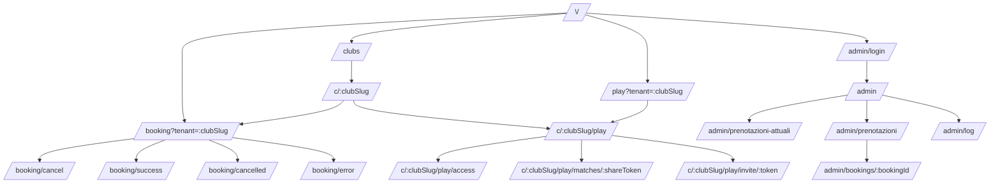

# Frontend Page Map

Questa mappa descrive le pagine frontend dichiarate in [frontend/src/App.tsx](../../frontend/src/App.tsx) e chiarisce quali URL sono canoniche, quali sono alias e come viene risolto il tenant del club.

## Regole di routing

- Le route Play canoniche usano sempre il pattern `/c/:clubSlug/play...`.
- Il tenant puo arrivare dal path (`/c/:clubSlug/...`) oppure dal query param `tenant`, `club` o `club_slug`.
- Gli alias Play sotto `/play...` redirigono verso la route canonica del club risolto.
- Se l'alias Play non riesce a risolvere il tenant, alcune route mostrano una shell di errore branded invece di una pagina vuota.
- `/access` da sola non e una route dell'app.

## Risoluzione tenant

- Fonte primaria: segmento path `:clubSlug`
- Fonte secondaria: query param `tenant`
- Fallback alias Play: `default-club`

Riferimenti:

- [frontend/src/utils/tenantContext.ts](../../frontend/src/utils/tenantContext.ts)
- [frontend/src/utils/play.ts](../../frontend/src/utils/play.ts)

## Mappa per area

### 1. Home e discovery pubblica

| Route | Tipo | Pagina | Note |
| --- | --- | --- | --- |
| `/` | Canonica | Home Matchinn | Entry principale del prodotto |
| `/clubs` | Canonica | Directory club | Lista club del network |
| `/clubs/nearby` | Canonica | Directory club geolocalizzata | Apre la stessa pagina con auto-locate |
| `/c/:clubSlug` | Canonica | Scheda pubblica club | Hub pubblico del club |

### 2. Booking pubblico

| Route | Tipo | Pagina | Note |
| --- | --- | --- | --- |
| `/booking` | Canonica | Booking pubblico | Tenant-aware via query param |
| `/booking/cancel` | Canonica | Annullamento prenotazione | Flow di cancellazione self-service |
| `/booking/success` | Canonica | Esito pagamento OK | Payment status success |
| `/booking/cancelled` | Canonica | Esito pagamento annullato | Payment status cancelled |
| `/booking/error` | Canonica | Esito pagamento errore | Payment status error |

Esempio valido:

- `/booking?tenant=default-club`

### 3. Community Play, route canoniche

| Route | Tipo | Pagina | Note |
| --- | --- | --- | --- |
| `/c/:clubSlug/play` | Canonica | Bacheca Play del club | Community privata del club |
| `/c/:clubSlug/play/access` | Canonica | Accesso community | Recovery o primo accesso |
| `/c/:clubSlug/play/access/:groupToken` | Canonica | Accesso community da gruppo | Preconfigura il flusso GROUP |
| `/c/:clubSlug/play/invite/:token` | Canonica | Invito community | Accettazione invito club |
| `/c/:clubSlug/play/matches/:shareToken` | Canonica | Match condiviso | Accesso da link partita |

Esempi validi:

- `/c/default-club/play`
- `/c/default-club/play/access`
- `/c/default-club/play/invite/invite-token-123`
- `/c/default-club/play/matches/share-token-123`

### 4. Community Play, alias

| Route | Tipo | Comportamento | Note |
| --- | --- | --- | --- |
| `/play` | Alias | Redirect a `/c/:clubSlug/play` | Usa tenant dal path o query; fallback `default-club` |
| `/play/access` | Alias | Redirect a `/c/:clubSlug/play/access` | Richiede tenant da query se non c'e nel path |
| `/play/access/:groupToken` | Alias | Redirect a `/c/:clubSlug/play/access/:groupToken` | Richiede tenant |
| `/play/invite/:token` | Alias | Redirect a invite canonico oppure errore branded | Se tenant manca, mostra shell "Link invito incompleto" |
| `/play/matches/:shareToken` | Alias | Redirect a shared match canonico oppure errore branded | Se tenant manca, mostra shell "Link partita incompleto" |

Esempi validi:

- `/play?tenant=default-club`
- `/play/access?tenant=default-club`
- `/play/access/group-open-day?tenant=default-club`

Esempio non valido:

- `/access`

### 5. Area admin

| Route | Tipo | Pagina | Note |
| --- | --- | --- | --- |
| `/admin/login` | Canonica | Login admin | Accesso backoffice |
| `/admin/reset-password` | Canonica | Reset password admin | Recupero credenziali |
| `/admin` | Canonica | Dashboard admin | Entry principale admin |
| `/admin/prenotazioni-attuali` | Canonica | Prenotazioni attuali | Vista operativa rapida |
| `/admin/prenotazioni` | Canonica | Elenco prenotazioni | Ricerca avanzata e ricorrenze |
| `/admin/log` | Canonica | Log admin | Audit operativo |
| `/admin/bookings/:bookingId` | Canonica | Dettaglio prenotazione | Pagina dettaglio booking |

## Fallback globale

| Route | Tipo | Comportamento |
| --- | --- | --- |
| `*` | Catch-all | Redirect alla home `/` |

## Mappa rapida dei flussi

## Note operative

- Se il club e noto, preferire sempre la route canonica `/c/:clubSlug/...`.
- Gli alias `/play...` sono utili per ingresso rapido o link con `tenant` in query, ma non sono la forma piu esplicita.
- Se online o locale una pagina Play sembra "mancare", verificare prima che l'URL non sia un path non supportato come `/access` senza contesto Play.
